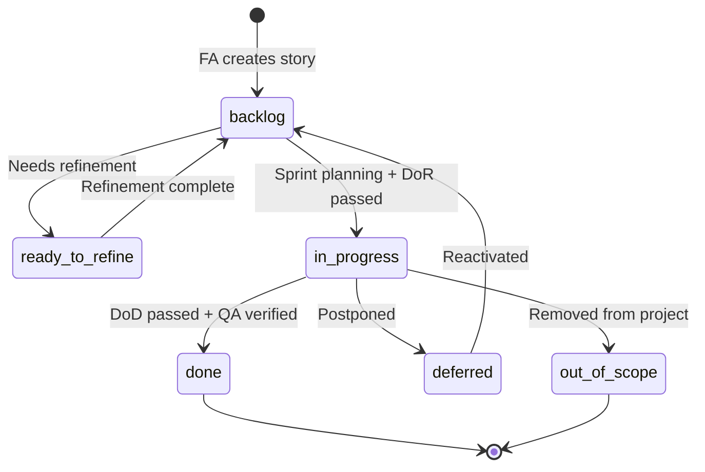

# TeamSpec

> **Product-Canon Operating Model for AI-Assisted Software Delivery**

[](https://www.npmjs.com/package/teamspec)
[](https://opensource.org/licenses/MIT)
[](https://marketplace.visualstudio.com/items?itemName=teamspec.teamspec)

---

## Normative vs Informative

| Content | Location | Status |
|---------|----------|--------|
| **Rules** (roles, commands, gates, artifacts) | [spec/4.0/](spec/4.0/) | **Normative** |
| **Overview** (this README) | README.md | Informative |
| **Agents** | [agents/](agents/) | Semi-normative |

**If this README conflicts with `spec/4.0/registry.yml`, the spec wins.**

---

## What is TeamSpec?

TeamSpec is a **Product-Canon Operating Model** that brings structure and clarity to software delivery. It provides a framework where:

- 📦 **Products** are the long-lived production truth (AS-IS state)
- 📋 **Projects** are time-bound change initiatives (TO-BE state)
- 📚 **Feature Canon** is the single source of truth for system behavior
- 📝 **Stories are deltas** — describing changes, not duplicating documentation  
- 👥 **Roles have clear boundaries** — PO, BA, FA, SA, DEV, QA, SM, DES
- 🤖 **AI agents understand context** — works with GitHub Copilot, Cursor, Claude, and more

```
┌─────────────────────────────────────────────────────────────────────┐
│                         PRODUCTS (AS-IS)                            │
│  Long-lived production truth. Updated only after deployment.        │
│                                                                     │
│  products/                                                          │
│  └── {product-id}/                                                  │
│      ├── product.yml          # Product definition (PO)             │
│      ├── features/            # CANONICAL Feature Canon             │
│      ├── business-analysis/   # Business context                    │
│      ├── solution-designs/    # Technical design                    │
│      └── technical-architecture/  # Architecture decisions          │
└─────────────────────────────────────────────────────────────────────┘
                                   ▲
                                   │ ts:po sync (after deployment)
                                   │
┌─────────────────────────────────────────────────────────────────────┐
│                        PROJECTS (TO-BE)                             │
│  Time-bound change initiatives. Propose changes to products.        │
│                                                                     │
│  projects/                                                          │
│  └── {project-id}/                                                  │
│      ├── project.yml          # Project definition (PO)             │
│      ├── feature-increments/  # PROPOSED changes to Canon           │
│      ├── epics/               # Story containers                    │
│      └── stories/             # Execution deltas                    │
└─────────────────────────────────────────────────────────────────────┘
```

---

## Quick Start

### Option 1: CLI (Recommended)

```bash
# Install globally
npm install -g teamspec

# Initialize in your repository
cd your-repo
teamspec
```

The CLI guides you through:
1. Team profile selection (startup, enterprise, regulated, etc.)
2. Organization and team configuration
3. Development cadence setup (scrum, kanban, scrumban)
4. Initial project creation

### Option 2: GitHub Copilot Integration

TeamSpec works natively with GitHub Copilot through instruction files:

1. **Clone or initialize** TeamSpec in your repository
2. **Ensure GitHub Copilot is active** in your editor
3. **Use TeamSpec commands** in Copilot Chat:

```
ts:po product         # Create new product
ts:po project         # Create project structure  
ts:fa story           # Create delta-based story
ts:dev plan           # Create implementation plan
ts:qa test            # Design test cases
ts:po status          # Project health overview
```

GitHub Copilot reads `.github/copilot-instructions.md` and `/agents/` to provide role-based assistance.

### Option 3: Manual Setup

Copy the `.teamspec/` folder from your CLI installation into your repository.

---

## Core Concepts

### Products vs Projects (4.0)

TeamSpec 4.0 introduces a clear separation between **Products** and **Projects**:

| Concept | Purpose | Lifecycle | Owner |
|---------|---------|-----------|-------|
| **Product** | Production truth (AS-IS state) | Permanent | PO |
| **Project** | Change proposal (TO-BE state) | Time-bound | PO |

This solves the "time-pollution problem" where project artifacts contaminate the canonical documentation of production systems.

### Feature Canon

The Feature Canon is the **authoritative source of truth** for what your system does. In TeamSpec 4.0, it lives in `/products/{product-id}/features/` and contains:

- **Feature files** (`f-PRX-NNN-description.md`) — Complete behavior specifications
- **Features index** — Registry of all features
- **Story ledger** — History of completed changes

```markdown
<!-- Example: f-DIT-001-user-authentication.md -->
# f-DIT-001: User Authentication

## Current Behavior
Users can log in with email/password...

## Business Rules
- BR-001: Passwords must be 8+ characters
- BR-002: Lock account after 5 failed attempts
```

### Feature-Increments (4.0)

Projects propose changes to the Feature Canon via **Feature-Increments**. These describe the TO-BE state without modifying the canonical documentation directly:

```markdown
<!-- Example: fi-DIT-001-oauth-login.md -->
# fi-DIT-001: OAuth Login (Feature-Increment)

## Reference
Product Feature: f-DIT-001 (User Authentication)

## Before (Current AS-IS)
Users can only log in with email/password.

## After (Proposed TO-BE)  
Users can also log in with Google OAuth.

## Impact
- Adds new authentication flow
- Requires new OAuth token handling
```

After deployment, the Feature-Increment is synced into the Feature Canon via `ts:po sync`.

### Canon Update Lifecycle

1. **During project:** Feature-Increments describe AS-IS (current) and TO-BE (proposed)
2. **Story completion:** FA marks stories Done after QA verification
3. **Deployment:** Code deployed to production
4. **Post-deploy sync:** PO runs `ts:po sync` to merge FI TO-BE into Product Canon
5. **Regression update:** QA confirms regression test coverage (rt-f-* files)

**Canon is NEVER updated before deployment.**

### Canon Hierarchy

- **Product Canon** = all production truth for a product
  - Location: `products/{product-id}/`
  - Includes: features, business-analysis, solution-designs, technical-architecture, decisions, regression-tests
  
- **Feature Canon** = behavioral subset of Product Canon
  - Location: `products/{product-id}/features/`
  - Contains: `f-PRX-NNN-*.md` files
  
- **Feature-Increments** = project deltas proposing future truth
  - Location: `projects/{project-id}/feature-increments/`
  - Contains: `fi-PRX-NNN-*.md` files with AS-IS/TO-BE sections

**Do not use "Canon" unqualified — always specify Product Canon or Feature Canon.**

### Epics

Epics are containers for related stories within a project. Stories MUST link to an Epic via their filename pattern.

**Pattern:** `epic-{PRX}-{NNN}-{description}.md`

**Key Rules:**
- Epics belong to FA (not BA)
- Every story must reference an Epic in its filename
- Epics define the TO-BE state for a coherent change

### Stories as Deltas

Stories don't duplicate documentation — they describe **changes** within a project. Stories MUST link to an Epic via filename.

**Pattern:** `s-e{EEE}-{SSS}-{description}.md` (where EEE = epic number, SSS = story sequence)

```markdown
## Linked Epic
epic-ACME-001 (Authentication Overhaul)

## Before (Current Behavior)
Reference: fi-ACME-001, Section: OAuth Login Flow

## After (New Behavior)  
Users can also log in with Google OAuth.

## Acceptance Criteria
- [ ] Google OAuth button appears on login page
- [ ] Successful Google auth creates/links account
```

### Role Boundaries

See [spec/4.0/roles.md](spec/4.0/roles.md) for the authoritative ownership matrix.

| Role | Owns | Does NOT Own | Primary Agent Commands |
|------|------|--------------|------------------------|
| **PO** | Products, Projects, PRX assignment, Canon sync, Deployment approval | Stories, Technical design, Sprint management | `ts:po product`, `ts:po project`, `ts:po sync`, `ts:po status` |
| **BA** | Business Analysis artifacts, Domain knowledge | Projects, Features, Feature-Increments, Epics, Stories | `ts:ba analysis`, `ts:ba ba-increment`, `ts:ba review` |
| **FA** | Features, Feature-Increments, Epics, Stories, Sync proposals | Products, Projects, Business intent, Technical design | `ts:fa feature`, `ts:fa feature-increment`, `ts:fa epic`, `ts:fa story` |
| **SA** | Solution Designs, Technical Architecture | Business requirements, Features, Stories | `ts:sa sd`, `ts:sa sd-increment`, `ts:sa ta`, `ts:sa ta-increment` |
| **DEV** | Implementation, Dev plans | Feature definitions, Scope changes | `ts:dev plan`, `ts:dev implement` |
| **QA** | Project test cases, Product regression tests, Bug reports, Deployment verification | Feature definitions, Canon updates | `ts:qa test`, `ts:qa regression`, `ts:qa verify` |
| **SM** | Sprint operations, Deployment gate process | Prioritization, Acceptance, Scope changes | `ts:sm sprint`, `ts:sm deploy-checklist` |
| **DES** | UX/UI design artifacts | Technical implementation, Scope decisions | — |

### Role Descriptions and Rules

#### Product Owner (PO)
**Ownership Domain:** Products, Product Canon, Projects, PRX assignment, Deployment approval, Canon sync

| Responsibility | Description |
|----------------|-------------|
| Product Definition | Create and own product structure with unique PRX prefix |
| Project Definition | Create projects that target one or more products |
| Deployment Approval | Approve deployment verification gate — no sync without PO approval |
| Canon Sync | Execute `ts:po sync` after deployment verification gate passed |
| Product Lifecycle | Manage active, deprecated, retired states |

**Hard Rules:**
- PO never modifies Product Canon during active project execution
- PO owns deployment gate — no sync without PO approval
- Product Canon updates require deployment verification
- Products must be registered before projects can target them
- PRX must be unique, 3-4 uppercase letters, and immutable

---

#### Business Analyst (BA)
**Ownership Domain:** Business Analysis artifacts, Domain knowledge documentation

| Responsibility | Description |
|----------------|-------------|
| Business Analysis | Create and own business analysis documents (`ba-PRX-*.md`) |
| BA Increments | Create BA increments in projects (`bai-PRX-*.md`) |
| Domain Knowledge | Document business processes and domain context |
| Review | Review Feature-Increments for business intent alignment |

**Hard Rules:**
- BA never creates Projects (PO responsibility)
- BA never creates Features (FA responsibility)
- BA never creates Feature-Increments (FA responsibility)
- BA never creates Epics (FA responsibility)
- BA never writes stories (FA responsibility)
- BA never defines system behavior details
- BA owns "what and why", never "how"

---

#### Functional Analyst (FA)
**Ownership Domain:** Features, Feature-Increments, Epics, Stories, Sync proposals

| Responsibility | Description |
|----------------|-------------|
| Feature Definition | Create and own Features in Product Canon (`f-PRX-*.md`) |
| Feature-Increments | Create Feature-Increments in projects (`fi-PRX-*.md`) |
| Epic Definition | Create and own Epics (`epic-PRX-*.md`) |
| Story Definition | Define Stories as deltas linked to Epics (`s-eXXX-YYY-*.md`) |
| Acceptance Criteria | Write testable ACs aligned to Feature Canon |
| Sync Proposals | Prepare sync proposals for PO review |

**Hard Rules:**
- All behavior must trace to BA analysis or stakeholder validation
- FA is the Feature Canon owner (creates features)
- Reject stories that restate features instead of deltas
- Stories must link to an Epic via filename (`s-eXXX-YYY-*.md` pattern)
- Feature-Increment must have AS-IS/TO-BE sections

**Critical Gate:** FA owns DoD — ensuring Feature-Increment TO-BE is complete before story is Done.

---

#### Solution Architect (SA)
**Ownership Domain:** Solution Designs, Technical Architecture (canonical and increments)

| Responsibility | Description |
|----------------|-------------|
| Technical Architecture | Create and maintain TA documents (`ta-PRX-*.md`) |
| TA Increments | Create TA increments in projects (`tai-PRX-*.md`) |
| Solution Design | Create solution designs (`sd-PRX-*.md`) |
| SD Increments | Create SD increments in projects (`sdi-PRX-*.md`) |
| Technical Review | Assess Feature-Increments for technical feasibility |

**Hard Rules:**
- Technical Architecture links to features and decisions
- High-level decisions only, not code-level
- Technical feasibility assessment, not requirement changes
- TA required before dev work on architecture-impacting changes

---

#### Developer (DEV)
**Ownership Domain:** Implementation, Task Planning, Code Delivery

| Responsibility | Description |
|----------------|-------------|
| Dev Plans | Create detailed dev plans per story |
| Implementation | Implement stories per Feature Canon and Technical Architecture |
| Reviewable Iterations | Deliver work in reviewable chunks |
| DoD Completion | Mark stories ready for testing when DoD met |

**Hard Rules:**
- DEV cannot redefine scope
- DEV cannot change feature behavior silently
- DEV must stop and escalate if Technical Architecture or Feature Canon is unclear
- Dev plan required before implementation starts
- All tasks must be reviewable

---

#### QA Engineer (QA)
**Ownership Domain:** Project test cases, Product regression tests, Bug reports, Deployment verification

| Responsibility | Description |
|----------------|-------------|
| Test Cases | Create test cases for Feature-Increments (`tc-fi-PRX-*.md`) |
| Regression Tests | Create/update regression tests in Product Canon (`rt-f-PRX-*.md`) |
| Bug Reports | Report and classify bugs (`bug-{project}-NNN-*.md`) |
| Regression Impact | Record regression impact at deployment (`ri-fi-PRX-*.md`) |
| Deployment Verification | Verify DoD compliance and deployment readiness |

**Hard Rules:**
- QA never updates Feature Canon directly (only regression tests)
- QA flags mismatches → FA decides on feature updates
- Tests are Feature-Increment level (`tc-fi-*`), not story-specific
- Bugs must be classified (implementation vs. canon vs. undocumented)
- Regression impact record required at deployment gate

**QA Two-Layer Model:**
- **Project Test Cases:** `projects/{id}/qa/test-cases/tc-fi-PRX-*.md` (validates FI)
- **Product Regression Tests:** `products/{id}/qa/regression-tests/rt-f-PRX-*.md` (long-term coverage)

---

#### Designer (DES)
**Ownership Domain:** User Experience, Design Artifacts, Interaction Design

| Responsibility | Description |
|----------------|-------------|
| UX Design | Create UX designs at Feature level |
| Design Consistency | Ensure design consistency and usability |
| User Validation | Validate designs with real users |

**Hard Rules:**
- Designs are feature canon, not story artifacts
- Designers work with personas from BA analysis
- Refuse to design if feature scope is unclear
- Refuse to design if personas are missing

---

#### Scrum Master (SM)
**Ownership Domain:** Sprint operations, Deployment gate process, Process facilitation

| Responsibility | Description |
|----------------|-------------|
| Sprint Management | Create and manage sprints (`sprint-N/`) |
| Sprint Planning | Facilitate sprint planning with PO and team |
| DoR Verification | Verify Definition of Ready before sprint commitment |
| Deployment Checklist | Run deployment verification checklist |
| Progress Tracking | Track progress and metrics |
| Ceremony Facilitation | Run standups, reviews, retros |

**Hard Rules:**
- SM does not prioritize (PO decides)
- SM does not change scope
- SM does not accept work (FA decides on Done)
- SM is metrics-driven and neutral
- SM owns deployment gate process (verification, checklist), PO has approval authority
- SM does NOT deploy — that is Operations

---

### Main Workflow

The TeamSpec workflow follows a structured order of operations with explicit role handoffs and quality gates:

```mermaid
flowchart TD
    subgraph "Phase 1: Product & Project Setup"
        P1["PRODUCT CREATION<br/>(PO)"] --> P2["PROJECT CREATION<br/>(PO)"]
        P2 --> G1{{"Gate:<br/>Project Exists"}}
    end
    
    subgraph "Phase 2: Analysis & Planning"
        G1 --> BA["BUSINESS ANALYSIS<br/>(BA)"]
        BA --> FI["FEATURE-INCREMENT<br/>(FA)"]
        FI --> EPIC["EPIC DEFINITION<br/>(FA)"]
        EPIC --> G2{{"Gate:<br/>Epics Defined"}}
    end
    
    subgraph "Phase 3: Story & Architecture"
        G2 --> STORY["STORY DEFINITION<br/>(FA)"]
        STORY --> G3{{"Gate:<br/>DoR Passed"}}
        G3 --> TA["TECHNICAL ARCHITECTURE<br/>(SA - if needed)"]
        TA --> SD["SOLUTION DESIGN<br/>(SA - if needed)"]
    end
    
    subgraph "Phase 4: Execution"
        SD --> SPRINT["SPRINT PLANNING<br/>(SM)"]
        SPRINT --> DEV["DEVELOPMENT<br/>(DEV)"]
        DEV --> QA["TESTING<br/>(QA)"]
        QA --> G4{{"Gate:<br/>DoD Passed"}}
    end
    
    subgraph "Phase 5: Deployment & Verification"
        G4 --> DEPLOY["PRODUCTION DEPLOY<br/>(Ops)"]
        DEPLOY --> VERIFY["DEPLOYMENT VERIFICATION<br/>(SM/QA)"]
        VERIFY --> G5{{"Gate:<br/>Verification Passed"}}
    end

    subgraph "Phase 6: Canon Sync (Post-Deployment)"
        G5 -.-> SYNC["CANON SYNC<br/>(PO)"]
        SYNC -.-> G6{{"Gate:<br/>Canon Updated"}}
    end

    style SYNC fill:#ff6b6b,stroke:#c92a2a,color:#fff
    style G6 fill:#ff6b6b,stroke:#c92a2a,color:#fff
```



> **Note:** Canon Sync (Phase 6) occurs **after deployment** to production. The Product Canon should only be updated to reflect behavior that is actually deployed and running. This is triggered via `ts:po sync` when the increment is verified in production.

### Role Handoffs

| From | To | Artifact | Trigger |
|------|----|----------|--------|
| BA | FA | Business analysis complete | BA review done |
| FA | SA | Feature-Increment created | Technical review needed |
| FA | DEV | Story ready | DoR passed |
| SA | DEV | TA/SD created | Technical constraints documented |
| DEV | QA | Code complete | PR created |
| QA | FA | Verified | DoD checks passed |
| QA | SM | Deployment verified | Regression impact recorded |
| SM | PO | Deployment ready | Checklist complete |
| PO | — | Canon synced | `ts:po sync` executed |

### Story State Machine



### Story State Folders

| Folder | Meaning |
|--------|--------|
| `stories/backlog/` | Ready for sprint planning |
| `stories/ready-to-refine/` | Needs refinement |
| `stories/in-progress/` | Under development |
| `stories/done/` | Completed |
| `stories/deferred/` | Postponed |
| `stories/out-of-scope/` | Removed from project |

> **Note:** Stories move between folders based on workflow state. Canon sync happens after deployment via `ts:po sync`.

---

## Project Structure

After initialization, your repository will have:

```
your-repo/
├── .teamspec/                      # Framework core
│   ├── agents/                     # Role-specific agents
│   ├── templates/                  # Document templates
│   ├── definitions/                # DoR/DoD checklists
│   ├── profiles/                   # Profile overlays
│   └── context/
│       └── team.yml                # Team configuration
│
├── products/                       # 📦 PRODUCTION TRUTH (AS-IS)
│   ├── products-index.md           # Product registry
│   └── {product-id}/               # e.g., acme-webshop/
│       ├── product.yml             # Product metadata (PO owns)
│       ├── README.md               # Product overview
│       ├── features/               # 📚 Feature Canon
│       │   ├── f-PRX-NNN-*.md      # Feature files (FA owns)
│       │   ├── features-index.md   # Feature registry
│       │   └── story-ledger.md     # Story history
│       ├── business-analysis/      # BA artifacts (ba-PRX-*.md)
│       ├── solution-designs/       # SA artifacts (sd-PRX-*.md)
│       ├── technical-architecture/ # SA artifacts (ta-PRX-*.md)
│       ├── decisions/              # Product decisions (dec-PRX-*.md)
│       └── qa/
│           └── regression-tests/   # QA regression tests (rt-f-PRX-*.md)
│
├── projects/                       # 📋 CHANGE PROPOSALS (TO-BE)
│   ├── projects-index.md           # Project registry
│   └── {project-id}/               # e.g., q1-auth-overhaul/
│       ├── project.yml             # Project metadata (PO owns)
│       ├── README.md               # Project overview
│       ├── feature-increments/     # 📝 Proposed changes (fi-PRX-*.md)
│       │   └── increments-index.md # Increment registry
│       ├── epics/                  # 📋 Epic definitions (epic-PRX-*.md)
│       │   └── epics-index.md      # Epic registry
│       ├── stories/                # 📝 Stories (s-eXXX-YYY-*.md)
│       │   ├── backlog/            # Ready for sprint
│       │   ├── ready-to-refine/    # Needs refinement
│       │   ├── in-progress/        # Under development
│       │   ├── done/               # Completed
│       │   ├── deferred/           # Postponed
│       │   └── out-of-scope/       # Removed
│       ├── business-analysis-increments/      # BA increments (bai-PRX-*.md)
│       ├── solution-design-increments/        # SA increments (sdi-PRX-*.md)
│       ├── technical-architecture-increments/ # SA increments (tai-PRX-*.md)
│       ├── decisions/              # Project decisions
│       ├── dev-plans/              # Implementation plans (dp-eXXX-sYYY-*.md)
│       ├── qa/
│       │   ├── test-cases/         # Test cases (tc-fi-PRX-*.md)
│       │   ├── bug-reports/        # Bug reports (bug-{project}-NNN-*.md)
│       │   ├── uat/                # UAT packs
│       │   └── regression-impact/  # Impact records (ri-fi-PRX-*.md)
│       └── sprints/                # Sprint management
│           ├── active-sprint.md    # Current sprint pointer
│           └── sprint-N/           # Sprint folders
```

---

## AI Agent Integration

### GitHub Copilot (Recommended)

TeamSpec provides native GitHub Copilot integration through instruction files:

**In Copilot Chat:**
```
ts:po product                 # Create/manage products (4.0)
ts:po project                 # Create/manage projects
ts:fa story                   # Create delta-based story
ts:dev plan                   # Create implementation plan
ts:qa test                    # Design test cases
ts:po sync                    # Sync increments to Canon (4.0)
ts:po status                  # Project health overview
ts:fix                        # Auto-fix lint errors
```

**How it works:**
1. GitHub Copilot reads `.github/copilot-instructions.md`
2. Loads role-specific agents from `/agents/` on demand
3. Applies team context from `.teamspec/context/team.yml`
4. Provides role-aware assistance with quality gates

### Other AI Assistants (Claude, ChatGPT, Cursor)

Use the agent prompts in `/agents/`:

1. Copy `AGENT_BOOTSTRAP.md` as system context
2. Add the role-specific agent (e.g., `AGENT_FA.md`, `AGENT_PO.md`)
3. Include your team context from `.teamspec/context/team.yml`

---

## Documentation

| Document | Purpose |
|----------|---------|
| [CLI README](cli/README.md) | CLI installation and commands |
| [Agents Guide](agents/README.md) | Role-based AI agent prompts |
| [Templates Guide](templates/README.md) | Document templates reference |
| [Roles & Responsibilities](roles/ROLES_AND_RESPONSIBILITIES.md) | Role boundaries and ownership |
| [Project Structure Reference](PROJECT_STRUCTURE_REFERENCE.md) | Detailed folder structure |
| **TeamSpec 4.0 Planning** | |
| [4.0 Overview](teamspec_4.0/README.md) | Product-Canon operating model |
| [4.0 Folder Structure](teamspec_4.0/FOLDER_STRUCTURE.md) | Complete 4.0 folder structure |
| [4.0 Artifact Glossary](teamspec_4.0/ARTIFACT_GLOSSARY.md) | All artifact types and naming |
| [4.0 Migration Guide](teamspec_4.0/07-MIGRATION-GUIDE.md) | Migrating from 2.0 to 4.0 |

---

## Command Reference

### CLI Commands

```bash
teamspec                  # Interactive setup
teamspec --profile X      # Use specific profile
teamspec lint             # Validate project structure
teamspec lint --project X # Lint specific project
teamspec update           # Update TeamSpec core files
teamspec generate-prompts # Generate GitHub Copilot prompt files
```

### Agent Commands (used in AI assistants like GitHub Copilot, Cursor, Claude)

| Command | Role | Description | Output |
|---------|------|-------------|--------|
| `ts:po product` | PO | Create new product with PRX prefix | `products/{id}/` structure |
| `ts:po project` | PO | Create new project targeting product(s) | `projects/{id}/` structure |
| `ts:po sync` | PO | Sync project changes to Product Canon (post-deploy) | Updated `products/**` |
| `ts:po status` | PO | Business/management health report (read-only) | Status report |
| `ts:ba analysis` | BA | Create business analysis document | `ba-PRX-*.md` |
| `ts:ba ba-increment` | BA | Create BA increment in project | `bai-PRX-*.md` |
| `ts:ba review` | BA | Review artifacts for business intent | Review comments |
| `ts:fa feature` | FA | Create feature in Product Canon | `f-PRX-*.md` |
| `ts:fa feature-increment` | FA | Create feature-increment in project | `fi-PRX-*.md` |
| `ts:fa epic` | FA | Create epic in project | `epic-PRX-*.md` |
| `ts:fa story` | FA | Create story linked to epic | `s-eXXX-YYY-*.md` |
| `ts:fa sync-proposal` | FA | Prepare sync proposal for PO | Sync proposal |
| `ts:sa ta` | SA | Create Technical Architecture document | `ta-PRX-*.md` |
| `ts:sa ta-increment` | SA | Create TA Increment in project | `tai-PRX-*.md` |
| `ts:sa sd` | SA | Create Solution Design document | `sd-PRX-*.md` |
| `ts:sa sd-increment` | SA | Create SD Increment in project | `sdi-PRX-*.md` |
| `ts:sa review` | SA | Review technical approach | Technical assessment |
| `ts:dev plan` | DEV | Create dev plan for story | `dp-eXXX-sYYY-*.md` |
| `ts:dev implement` | DEV | Execute implementation | Code changes |
| `ts:qa test` | QA | Create test cases for Feature-Increment | `tc-fi-PRX-*.md` |
| `ts:qa regression` | QA | Update product regression tests | `rt-f-PRX-*.md` |
| `ts:qa verify` | QA | Validate DoD compliance | Verification report |
| `ts:sm sprint` | SM | Create/manage sprint | `sprint-N/*` |
| `ts:sm deploy-checklist` | SM | Run deployment readiness checklist | Deployment checklist |
| `ts:lint` | Any | Run linter | Lint report |
| `ts:fix` | Any | Auto-fix lint errors | Fixed files |
| `ts:agent <role>` | Any | Load role-specific agent | Agent loaded |

---

## Profiles

TeamSpec supports different team profiles:

| Profile | Characteristics |
|---------|-----------------|
| **startup** | Minimal process, fast iteration |
| **enterprise** | Full governance, compliance |
| **regulated** | Audit trails, formal approvals |
| **agency** | Multi-client, project-based |
| **opensource** | Community-driven, RFC-style |

Select during `teamspec init` or with `--profile`.

---

## Quality Gates

### Gate Overview

| Gate | Owner | Verifier | Approver | When |
|------|-------|----------|----------|------|
| DoR | FA | SM | — | Before story enters development |
| DoD | FA | QA | — | Before story marked complete |
| Deployment Verification | SM | QA | PO | After production deploy, before sync |
| Canon Sync | PO | — | — | After Deployment Verification passed |

### Definition of Ready (DoR)

**Owner:** FA | **Verifier:** SM

Before a story enters `in-progress/`:
- [ ] Story linked to Epic via filename (`s-eXXX-YYY-*.md`)
- [ ] Feature-Increment exists with AS-IS/TO-BE sections
- [ ] Acceptance Criteria are testable
- [ ] No TBD/placeholder content
- [ ] Estimate assigned

### Definition of Done (DoD)

**Owner:** FA | **Verifier:** QA

Before a story moves to `done/`:
- [ ] All Acceptance Criteria verified by QA
- [ ] Code reviewed and merged
- [ ] Tests passing
- [ ] Feature-Increment TO-BE section complete
- [ ] Ready for deployment

### Deployment Verification Gate

**Owner:** SM | **Verifier:** QA | **Approver:** PO

After production deploy + feature toggles enabled (if applicable), before `ts:po sync`:
- [ ] All sprint stories in terminal state (Done/Deferred/Out-of-Scope)
- [ ] All Feature-Increments reviewed
- [ ] **Code deployed to production**
- [ ] **Feature toggles enabled** (or N/A if not using toggles)
- [ ] Smoke tests passed in production
- [ ] QA sign-off obtained
- [ ] **Regression impact recorded** (`ri-fi-PRX-*.md` for each FI)
- [ ] PO approval obtained

### Canon Sync Gate

**Owner:** PO | **Precondition:** Deployment Verification gate passed

After deployment verification:
- Run `ts:po sync`
- Feature-Increment TO-BE sections merged into Product Feature Canon
- Canon is NEVER updated before deployment

---

## Contributing

We welcome contributions! Please see our [Contributing Guide](CONTRIBUTING.md) for details.

### Development Setup

```bash
# Clone the repository
git clone https://github.com/teamspec/teamspec.git
cd teamspec

# CLI development
cd cli
npm install
npm test

# VS Code extension development
cd vscode-extension
npm install
npm run compile
```

---

## License

MIT License — see [LICENSE](LICENSE) for details.

---

## Links

- 📦 [npm package](https://www.npmjs.com/package/teamspec)
- 🐛 [Issue tracker](https://github.com/teamspec/teamspec/issues)
- 📖 [Documentation](https://github.com/teamspec/teamspec/wiki)

---

<p align="center">
  <strong>Built for teams who believe documentation should be a living asset, not a burden.</strong>
</p>
