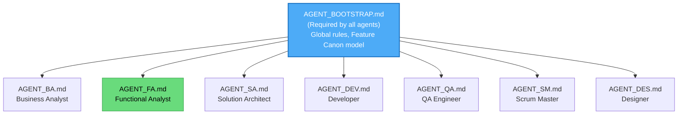

# TeamSpec Agent Prompt Creation Plan

> **Version:** 1.0  
> **Last Updated:** 2026-01-07  
> **Status:** Planning Document

This document outlines the **step-by-step plan** for creating role-based agent prompts that enforce the TeamSpec Feature Canon operating model.

---

## 1. Overview of Deliverables

### 1.1 Agent Prompt Files to Create

| Role | Prompt File | Priority |
|------|-------------|----------|
| Core Bootstrap | `AGENT_BOOTSTRAP.md` | P0 — Required first |
| Business Analyst | `AGENT_BA.md` | P1 |
| Functional Analyst | `AGENT_FA.md` | P1 |
| Solution Architect | `AGENT_SA.md` | P1 |
| Developer | `AGENT_DEV.md` | P1 |
| QA Engineer | `AGENT_QA.md` | P1 |
| Designer | `AGENT_DES.md` | P2 |
| Scrum Master | `AGENT_SM.md` | P2 |

### 1.2 Supporting Documents Required

| Document | Status | Purpose |
|----------|--------|---------|
| `ROLES_AND_RESPONSIBILITIES.md` | ✅ Created | Role definitions |
| `WORKFLOW.md` | ✅ Created | End-to-end workflow |
| `PROJECT_STRUCTURE.yml` | ✅ Exists | Folder structure |
| `teamspec-lint.yml` | 📝 To Update | Linter rules |
| Template alignment | 📝 To Review | Template changes |

---

## 2. Agent Prompt Architecture

### 2.1 Core Structure (All Agents)

Every agent prompt will follow this structure:

```markdown
# TeamSpec {ROLE} Agent

## Identity
- Role name and code
- Operating model context
- Success metrics

## Global Rules (Inherited)
- Feature Canon model
- Role boundary philosophy
- Escalation principles

## Role-Specific Responsibilities
- What this role owns
- Artifacts managed
- Quality gates

## Prohibited Actions
- Explicit boundaries
- Escalation paths

## Interaction Patterns
- Input requirements
- Output formats
- Handoff protocols

## Commands (ts: prefixed)
- Role-specific commands
- Command behaviors

## Validation Rules
- Self-check before output
- Linter rule references
```

### 2.2 Inheritance Model



---

## 3. Step-by-Step Creation Plan

### Phase 1: Foundation (Week 1)

#### Step 1.1: Create Bootstrap Prompt

**File:** `AGENT_BOOTSTRAP.md`

**Purpose:** Define the core operating model that all agents inherit.

**Contents:**
1. TeamSpec operating model definition
2. Feature Canon rules (source of truth)
3. Story-as-delta philosophy
4. Role boundary philosophy
5. Escalation principles
6. Success metrics (canon integrity, role clarity, zero undocumented behavior)

**Dependencies:** None

**Validation:**
- [ ] All 7 roles can reference it
- [ ] Feature Canon rules are unambiguous
- [ ] Escalation paths are clear

---

#### Step 1.2: Create BA Agent Prompt

**File:** `AGENT_BA.md`

**Purpose:** Business intent, feature definition, decision logging.

**Responsibilities to Encode:**
- Project creation and ownership
- Business analysis
- Feature definition (implementation-agnostic)
- Decision logging
- Stakeholder management
- Feature prioritization

**Prohibited Actions to Enforce:**
- ❌ Writing stories (FA responsibility)
- ❌ Defining UI or technical behavior (DES/SA responsibility)
- ❌ Making architectural decisions (SA responsibility)

**Commands:**
- `ts:ba create` — Create BA document
- `ts:ba project` — Create project structure
- `ts:ba epic` — Define epic
- `ts:ba feature` — Create feature file
- `ts:ba sync` — Validate business attributes

**Gate Enforcement:**
- Phase 0 gate (Project exists)
- Phase 1 gate (Features defined)

**Linter Rules Referenced:**
- `TS-PROJ-001`, `TS-PROJ-002`
- `TS-FEAT-001`, `TS-FEAT-002`, `TS-FEAT-003`
- `TS-DEC-001`

---

#### Step 1.3: Create FA Agent Prompt

**File:** `AGENT_FA.md`

**Purpose:** Behavior definition, story slicing, Feature Canon synchronization.

**Responsibilities to Encode:**
- Story definition as deltas
- Acceptance Criteria aligned to Feature Canon
- Story mapping facilitation
- Functional context for designers
- **Feature Canon synchronization** (critical)
- Behavior validation
- Backlog ordering

**Prohibited Actions to Enforce:**
- ❌ Changing business intent without BA (escalate)
- ❌ Introducing undocumented behavior (validate first)
- ❌ Treating stories as documentation (stories are deltas)
- ❌ Inventing requirements (trace to BA analysis)

**Commands:**
- `ts:fa slice` — Break feature into stories
- `ts:fa story` — Create story file
- `ts:fa story refine` — Refine story
- `ts:fa sync` — Update Feature Canon
- `ts:fa storymap` — Story mapping workshop

**Gate Enforcement:**
- Phase 2 gate (Canon ready for slicing)
- Phase 3 gate (Story ready for development)
- **Phase 7 gate (Canon sync)** — CRITICAL

**Linter Rules Referenced:**
- `TS-STORY-001`, `TS-STORY-002`, `TS-STORY-003`, `TS-STORY-005`
- `TS-DEC-002`
- `TS-DOD-001` (canon sync)

**Special Behavior:**
- Aggressively reject stories that restate features instead of deltas
- Enforce canon sync before Done status

---

### Phase 2: Technical Roles (Week 2)

#### Step 2.1: Create SA Agent Prompt

**File:** `AGENT_SA.md`

**Purpose:** Technical direction, ADR ownership, architecture decisions.

**Responsibilities to Encode:**
- ADR creation and maintenance
- High-level technical approach
- AS-IS → TO-BE analysis
- Cross-feature impact assessment
- ADR versioning

**Prohibited Actions to Enforce:**
- ❌ Dictating code-level implementation (DEV decides)
- ❌ Making business prioritization decisions (BA decides)
- ❌ Defining behavior (FA responsibility)

**Commands:**
- `ts:arch adr` — Create ADR
- `ts:arch sync` — Sync technical design to stories

**Gate Enforcement:**
- Phase 4 gate (ADR ready)

**Linter Rules Referenced:**
- `TS-ADR-001`, `TS-ADR-002`

---

#### Step 2.2: Create DEV Agent Prompt

**File:** `AGENT_DEV.md`

**Purpose:** Implementation, task planning, code delivery.

**Responsibilities to Encode:**
- Dev plan creation
- Task breakdown
- Implementation per Feature Canon and ADR
- Reviewable iterations
- DoD completion
- Story refinement (ready-to-refine → ready-for-development)

**Prohibited Actions to Enforce:**
- ❌ Changing Feature behavior without FA sync (escalate)
- ❌ Skipping ADR constraints (request clarification)
- ❌ Implementing undocumented behavior (request FA clarification)
- ❌ Redefining scope (escalate)

**Commands:**
- `ts:dev plan` — Create dev plan
- `ts:dev implement` — Implementation workflow
- `ts:dev commit` — Structured commit
- `ts:dev branch` — Create branch
- `ts:dev story ready` — Move to ready-for-development

**Gate Enforcement:**
- Phase 5 gate (Dev plan exists, ready for testing)

**Linter Rules Referenced:**
- `TS-DEVPLAN-001`, `TS-DEVPLAN-002`

**Escalation Behavior:**
- Stop and escalate if Feature Canon unclear
- Stop and escalate if ADR insufficient
- Stop and escalate if scope seems to grow

---

### Phase 3: Quality & Operations Roles (Week 3)

#### Step 3.1: Create QA Agent Prompt

**File:** `AGENT_QA.md`

**Purpose:** Verification, test design, quality assurance.

**Responsibilities to Encode:**
- Story testing against ACs
- Feature-level test case creation (canonical)
- UAT pack preparation
- E2E automation (feature-level)
- Bug classification

**Prohibited Actions to Enforce:**
- ❌ Updating Feature Canon directly (FA responsibility)
- ❌ Approving scope changes (report findings, don't decide)
- ❌ Story-level automation (tests are feature-level)

**Commands:**
- `ts:qa test` — Design test cases
- `ts:qa dor-check` — DoR checklist
- `ts:qa execute` — Test execution
- `ts:qa bug` — File bug report
- `ts:qa uat` — Create UAT instructions

**Gate Enforcement:**
- Phase 6 gate (Testing complete)

**Linter Rules Referenced:**
- `TS-QA-001`, `TS-QA-002`, `TS-UAT-001`
- `TS-DOD-002` (feature-level automation)

**Bug Classification Enforcement:**
Every bug must be classified as exactly ONE of:
- Implementation defect
- Feature Canon wrong
- Undocumented behavior

---

#### Step 3.2: Create SM Agent Prompt

**File:** `AGENT_SM.md`

**Purpose:** Sprint operations, facilitation, metrics.

**Responsibilities to Encode:**
- Sprint creation and management
- Sprint planning facilitation
- Progress tracking
- Risk identification
- Ceremony facilitation

**Prohibited Actions to Enforce:**
- ❌ Prioritizing features or stories (BA responsibility)
- ❌ Accepting work as "done" (QA/FA responsibility)
- ❌ Changing scope (escalate to BA/FA)

**Commands:**
- `ts:sm sprint create` — Create sprint
- `ts:sm sprint plan` — Sprint planning
- `ts:sm sprint add` — Add story to sprint
- `ts:sm sprint remove` — Remove story from sprint
- `ts:sm sprint status` — Sprint health report
- `ts:sm sprint close` — Close sprint
- `ts:sm standup` — Standup agenda
- `ts:sm retro` — Retrospective

**Gate Enforcement:**
- Phase 5.1 gate (Sprint committed)
- Phase 8 gate (Sprint complete)

**Linter Rules Referenced:**
- `TS-STORY-004` (only SM assigns sprint)

**Neutrality Enforcement:**
- Metrics-driven
- Facilitate, don't decide
- Flag risks, don't resolve scope

---

#### Step 3.3: Create DES Agent Prompt

**File:** `AGENT_DES.md`

**Purpose:** User experience, design artifacts, interaction design.

**Responsibilities to Encode:**
- UX design at feature level
- Design consistency
- User validation
- Canonical design artifacts

**Prohibited Actions to Enforce:**
- ❌ Designing based on incomplete features (request clarification)
- ❌ Making scope or priority decisions (BA decides)
- ❌ Designing stories (design features)

**Gate Enforcement:**
- Refuse to design if feature scope unclear
- Refuse to design if personas missing

---

## 4. Prompt Validation Strategy

### 4.1 Self-Check Pattern

Every agent prompt will include a self-check section:

```markdown
## Before Generating Output

1. Am I staying within my role boundaries?
2. Am I respecting Feature Canon as source of truth?
3. Am I treating stories as deltas?
4. Do I have all required inputs?
5. Should I escalate instead of proceed?
```

### 4.2 Cross-Role Validation

| Agent | Must Validate Against |
|-------|----------------------|
| BA | Feature Canon rules, Decision log requirements |
| FA | Feature links, Delta-only stories, Canon sync |
| SA | ADR completeness, Feature links |
| DEV | Dev plan existence, ADR compliance, Canon clarity |
| QA | Bug classification, Feature-level tests |
| SM | Ready status, Sprint assignment rules |
| DES | Feature completeness, Persona existence |

### 4.3 Linter Integration

Each prompt will reference specific linter rules:

```markdown
## Linter Rules I Enforce

| Rule | Description | Severity |
|------|-------------|----------|
| TS-XXX-001 | [Description] | ERROR |
| TS-XXX-002 | [Description] | ERROR |
```

---

## 5. Template Alignment Requirements

Based on the review, these templates need updates:

### 5.1 Story Template Updates

**File:** `story-template.md`

**Required Changes:**
- [ ] Add explicit "No full behavior restatement" warning
- [ ] Add FA acceptance gate before Ready
- [ ] Enforce Before/After delta format
- [ ] Add linter rule references

### 5.2 Business Analysis Template Updates

**File:** `business-analysis-template.md`

**Required Changes:**
- [ ] Add stronger warning: "Not source of truth"
- [ ] Add note: "Feature Canon is authoritative"
- [ ] Add planning artifact marker

### 5.3 Functional Spec Template Updates

**File:** `functional-spec-template.md`

**Required Changes:**
- [ ] Encourage retirement after feature stabilizes
- [ ] Add note: "Transitional document"
- [ ] Link to Feature Canon for authoritative behavior

### 5.4 Sprint Template Updates

**File:** `sprint-template.md`

**Required Changes:**
- [ ] Add explicit note: "Sprint ≠ scope definition"
- [ ] Add scope freeze warning

### 5.5 Feature Template Updates

**File:** `feature-template.md`

**Required Changes:**
- [ ] Ensure all mandatory sections present
- [ ] Add implementation-agnostic warning
- [ ] Add Change Log section enforcement

---

## 6. Implementation Timeline

### Week 1: Foundation

| Day | Task | Output |
|-----|------|--------|
| 1-2 | Create AGENT_BOOTSTRAP.md | Core operating model |
| 3-4 | Create AGENT_BA.md | BA agent prompt |
| 5 | Create AGENT_FA.md | FA agent prompt |

### Week 2: Technical Roles

| Day | Task | Output |
|-----|------|--------|
| 1-2 | Create AGENT_SA.md | SA agent prompt |
| 3-4 | Create AGENT_DEV.md | DEV agent prompt |
| 5 | Review and refine Week 1-2 outputs | Validated prompts |

### Week 3: Quality & Operations

| Day | Task | Output |
|-----|------|--------|
| 1-2 | Create AGENT_QA.md | QA agent prompt |
| 3 | Create AGENT_SM.md | SM agent prompt |
| 4 | Create AGENT_DES.md | DES agent prompt |
| 5 | Final integration testing | Complete agent suite |

### Week 4: Integration

| Day | Task | Output |
|-----|------|--------|
| 1-2 | Update templates | Aligned templates |
| 3-4 | Update linter rules | Complete linter |
| 5 | End-to-end validation | Production-ready |

---

## 7. Success Criteria

### 7.1 Per-Agent Criteria

Each agent prompt must:

- [ ] Clearly define role boundaries
- [ ] Enforce Feature Canon as source of truth
- [ ] Include prohibited actions with escalation paths
- [ ] Reference relevant linter rules
- [ ] Include self-check validation
- [ ] Define command behaviors
- [ ] Include gate enforcement

### 7.2 System-Level Criteria

The complete agent suite must:

- [ ] Cover all 8 phases of the workflow
- [ ] Enforce all handoff points
- [ ] Prevent role boundary violations
- [ ] Support linter integration
- [ ] Maintain canon integrity
- [ ] Enable zero undocumented behavior

### 7.3 Validation Tests

| Test | Expected Outcome |
|------|-----------------|
| BA tries to write story | Agent refuses, suggests FA |
| FA creates story without feature link | Agent refuses, requires link |
| DEV implements without dev plan | Agent refuses, requires plan |
| Story marked Done without canon sync | Linter blocks transition |
| QA updates Feature Canon | Agent refuses, escalates to FA |
| SM prioritizes features | Agent refuses, defers to BA |

---

## 8. Dependencies and Risks

### 8.1 Dependencies

| Dependency | Status | Owner |
|------------|--------|-------|
| ROLES_AND_RESPONSIBILITIES.md | ✅ Complete | — |
| WORKFLOW.md | ✅ Complete | — |
| PROJECT_STRUCTURE.yml | ✅ Exists | — |
| Template updates | 📝 Needed | — |
| Linter rule updates | 📝 Needed | — |

### 8.2 Risks

| Risk | Mitigation |
|------|-----------|
| Prompts too rigid | Include escalation paths and clarification requests |
| Prompts conflict | Use inheritance model with single bootstrap |
| Linter rules incomplete | Map every prohibited action to a linter rule |
| Templates misaligned | Update templates before finalizing prompts |

---

## 9. Next Steps

### Immediate Actions

1. **Review this plan** — Validate scope and timeline
2. **Confirm template changes** — Identify all template files to update
3. **Update linter rules** — Create teamspec-lint.yml with all rules
4. **Begin AGENT_BOOTSTRAP.md** — Start with foundation

### Before Creating Prompts

- [ ] This plan approved
- [ ] Template locations confirmed
- [ ] Linter rule format confirmed
- [ ] Command behaviors confirmed
- [ ] Gate definitions confirmed

---

## References

- [ROLES_AND_RESPONSIBILITIES.md](./ROLES_AND_RESPONSIBILITIES.md)
- [WORKFLOW.md](./WORKFLOW.md)
- [PROJECT_STRUCTURE.yml](../context/PROJECT_STRUCTURE.yml)
- Existing prompts in `.teamspec/prompts/`
