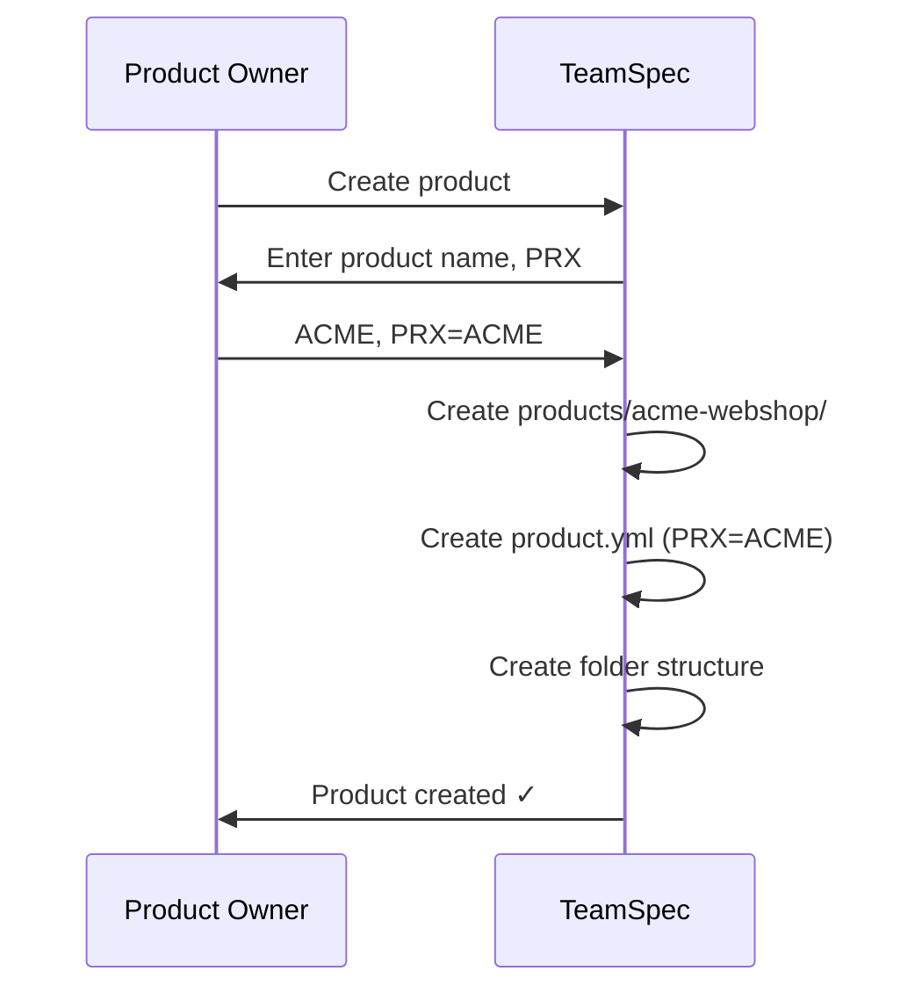
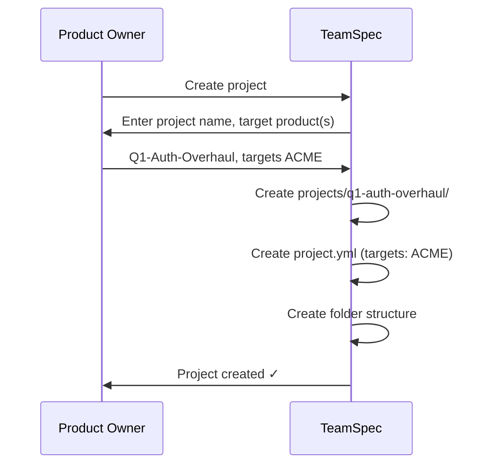
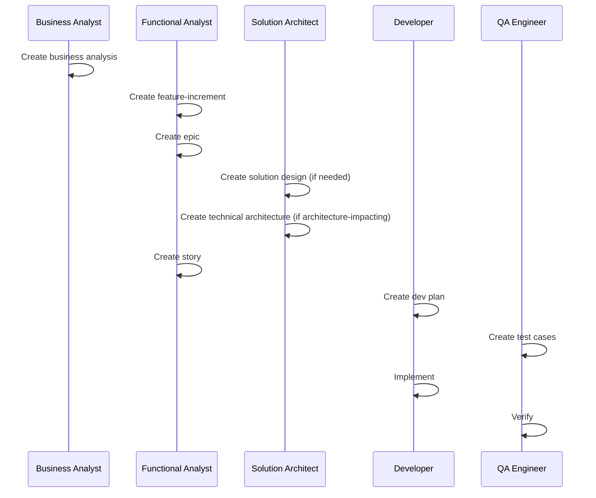
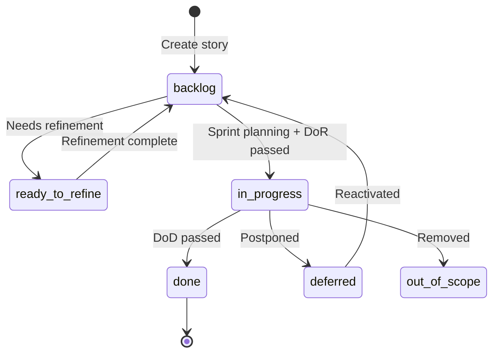
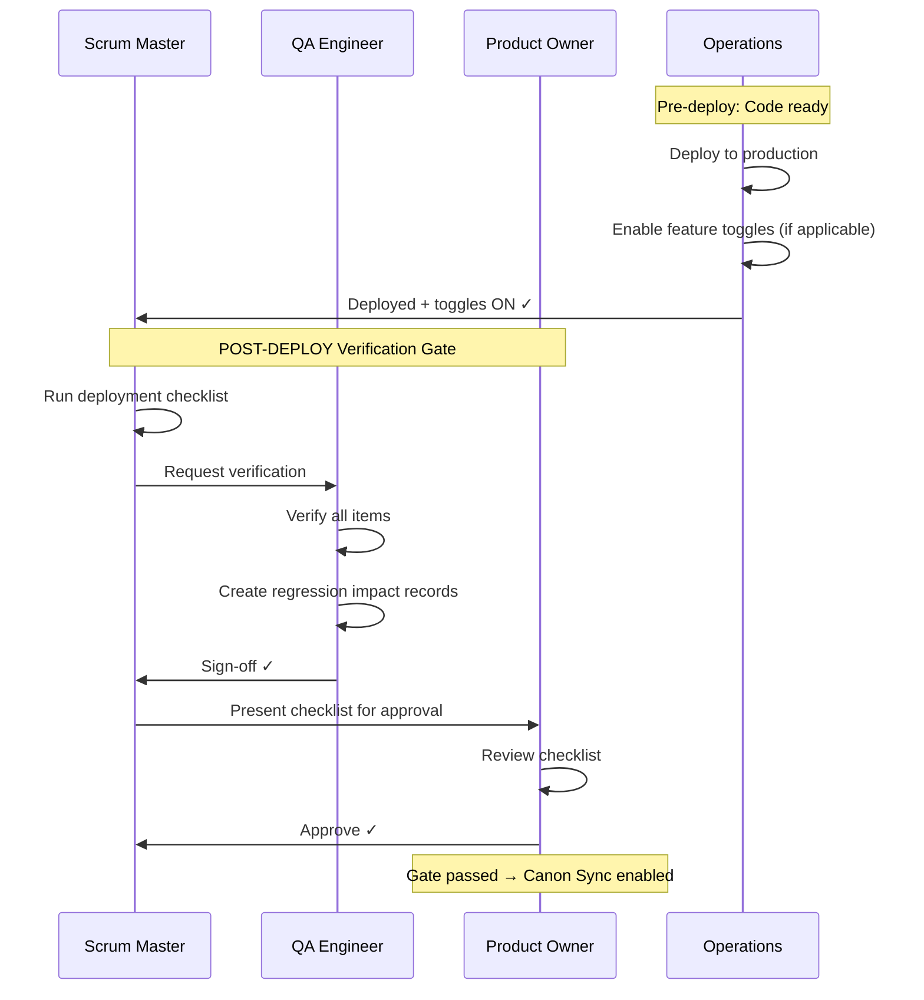
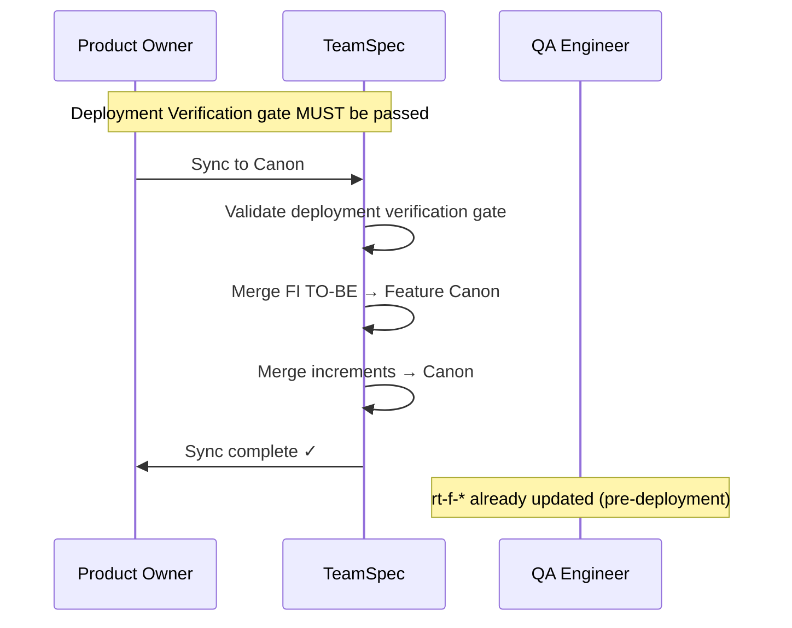

# TeamSpec 4.0 Workflows

> **Status:** Normative  
> **Source:** [registry.yml](registry.yml)

---

## Overview

TeamSpec 4.0 defines clear workflows for product/project management with explicit handoffs between roles.

---

## Product Creation Workflow

### Outputs

- `products/{product-id}/product.yml`
- `products/{product-id}/features/`
- `products/{product-id}/business-analysis/`
- `products/{product-id}/solution-designs/`
- `products/{product-id}/technical-architecture/`
- `products/{product-id}/decisions/`
- `products/{product-id}/qa/regression-tests/`

---

## Project Creation Workflow

### Outputs

- `projects/{project-id}/project.yml`
- `projects/{project-id}/feature-increments/`
- `projects/{project-id}/epics/`
- `projects/{project-id}/stories/` (with state folders)
- `projects/{project-id}/dev-plans/`
- `projects/{project-id}/qa/test-cases/`
- `projects/{project-id}/qa/bug-reports/`
- `projects/{project-id}/qa/regression-impact/`
- `projects/{project-id}/sprints/`

---

## Feature Development Workflow

---

## Story Lifecycle

### State Folders

| Folder | Meaning |
|--------|---------|
| `stories/backlog/` | Ready for sprint |
| `stories/ready-to-refine/` | Needs refinement |
| `stories/in-progress/` | Under development |
| `stories/done/` | Completed |
| `stories/deferred/` | Postponed |
| `stories/out-of-scope/` | Removed |

---

## Deployment + Verification Workflow

> **Gate Owner:** SM (process)  
> **Gate Approver:** PO  
> **Gate Verifier:** QA

### Deployment Verification Gate Checks (per [gates.md](gates.md))

1. All sprint stories in terminal state (Done/Deferred/Out-of-Scope)
2. All Feature-Increments reviewed
3. **Code deployed to production**
4. **Feature toggles enabled** (or N/A)
5. Smoke tests passed in production
6. QA sign-off obtained
7. Regression impact recorded for each FI (`ri-fi-PRX-NNN.md`)
8. PO approval obtained

**Note:** SM owns the gate process (verification, checklist). PO has approval authority. SM does NOT perform the deploy — that is operations. The sequence is: **deploy → toggle ON → verification gate → ts:po sync**.

---

## Canon Sync Workflow

> **Gate Owner:** PO  
> **Precondition:** Deployment Verification gate passed

### Sync Effect

| Source (Project) | Target (Product) | Action |
|------------------|------------------|--------|
| `fi-PRX-NNN-*.md` TO-BE | `f-PRX-NNN-*.md` | Merge/update |
| `bai-PRX-NNN-*.md` | `ba-PRX-NNN-*.md` | Merge/update |
| `sdi-PRX-NNN-*.md` | `sd-PRX-NNN-*.md` | Merge/update |
| `tai-PRX-NNN-*.md` | `ta-PRX-NNN-*.md` | Merge/update |

**Note:** Regression tests (`rt-f-PRX-NNN`) are updated as part of deployment verification gate (before canon sync), not after sync.

---

## Role Handoffs

| From | To | Artifact | Trigger |
|------|----|----------|---------|
| BA | FA | Business analysis complete | BA review done |
| FA | DEV | Story ready | DoR passed |
| DEV | QA | Code complete | PR created |
| QA | FA | Verified | DoD checks passed |
| SM | PO | Deployment ready | Checklist complete |
| PO | — | Canon synced | `ts:po sync` executed |

---

## Sprint Ceremonies

### Sprint Planning

1. SM creates sprint
2. PO prioritizes backlog
3. FA refines stories
4. Team commits to sprint

### Sprint Review

1. Demo completed stories
2. QA presents verification results
3. FA confirms DoD compliance

### Sprint Retrospective

Team retrospective facilitated by SM.

### Deployment

1. Operations deploys to production
2. Operations enables feature toggles (if applicable)
3. SM runs verification checklist
4. QA verifies and records regression impact
5. PO approves deployment verification gate
6. PO syncs canon
